# Springboot-light-project
> Di seguito le versioni delle principali dipendenze Maven utilizzate:

 [![Spring Version][spring-image]][spring-url]

 [![Spring Doc Version][spring-doc-image]][spring-doc-url]

 [![Spring Cloud Version][spring-cloud-image]][spring-cloud-url]

 [![Logback Version][logback-image]][logback-url]

# Contenuti
* [Feature](#feature)
* [Creazione e avvio](#creazione-e-avvio)
* [Descrizione degli esempi forniti](#descrizione-degli-esempi-forniti)
* [Deployment su Openshift](#deployment-su-openshift)
* [Installazione standalone](#installazione-standalone)
* [Tips and Tricks](#tips-and-tricks)
* [Autori e ringraziamenti](#autori-e-ringraziamenti)


# Feature
L'archetipo offre le seguenti feature:
* __Strato di API Rest__: sviluppate utilizzando il modello Spring MVC;
* __Metriche__: implementazione con framework Actuator e Micrometer (per integrare le metriche Actuator con sistemi di monitoraggio esterni come Prometheus) che garantiscono l’esposizione di metriche in formato JSON e Prometheus su url dedicate ed esposte dalla stessa applicazione;
* __Servizi di Health__: implementati utilizzando Actuator. Sono indispensabili per il deploy in ambiente OpenShift;
* __Strato di logging__: realizzato utilizzando le librerie di Logback. Disponibile anche logging in formato JSON;
* __Sistema di tracing__: implementato utilizzando le librerie di Sleuth;
* __Persistenza__: realizzata mediante l'implementazione Hibernate di JPA;
* __Datasource__:
	* DB in-memory H2 di esempio con connection pool gestito tramite Hikari;
* __Documentazione delle API Rest__: implemenata con OpenApi;
* __Meccanismo di Retry__: implementato con Spring Retry;
* __Meccanismo di Circuit Breaker__: implementato utilizzando le librerie di Hystrix;
* __Lazy Initialization__: per ridurre i tempi di startup è stata prevista un'inizializzazione di tipo Lazy, ovvero i bean sono creati ( e le proprie dipendenze iniettate ) solo quando vengono richiesti. Questa configurazione è ottenuta settando la seguente property nel file *application.properites*:
  ```
  spring.main.lazy-initialization=true
  ```
  I bean che devono essere creati in fase di avvio devono avere l'annotation *@Lazy(false)*, per esempio:

  ```java
  ...
  @Service
  @Slf4j
  @Lazy(false)
  public class KafkaConsumerService { 
  ...
  ```

# Creazione e avvio
Prima di poter generare un nuovo progetto springboot a partire dall'archetipo, bisogna configurare nel file .m2/settings.xml il repository degli archetipi come mostrato di seguito:

	<mirrors>
		<mirror>
			<id>internal-repository</id>
			<name>Maven Repository Manager running on repo.mycompany.com</name>
			<url>http://alm-repos.sogei.it:8081/repository/maven-repos/</url>
			<mirrorOf>*</mirrorOf>
		</mirror>
	</mirrors>
	<profiles>
		<profile>
			<id>maven-repos</id>
			<repositories>
				<repository>
					<id>maven-repos</id>
					<url>http://alm-repos.sogei.it:8081/repository/maven-repos/</url>
					<snapshots>
						<enabled>true</enabled>
					</snapshots>
					<releases>
						<enabled>true</enabled>
					</releases>
				</repository>
			</repositories>
		</profile>
	</profiles>
	<activeProfiles>
		<activeProfile>maven-repos</activeProfile>
	</activeProfiles>

## Creazione del progetto con Eclipse

Questa sezione descrive come importare il maven archetype catalogs in eclipse per creare un progetto springboot.

### Step 1: Aprire maven preferences in Eclipse

Andare su:

Windows -> Preferences -> Maven -> Archetypes.

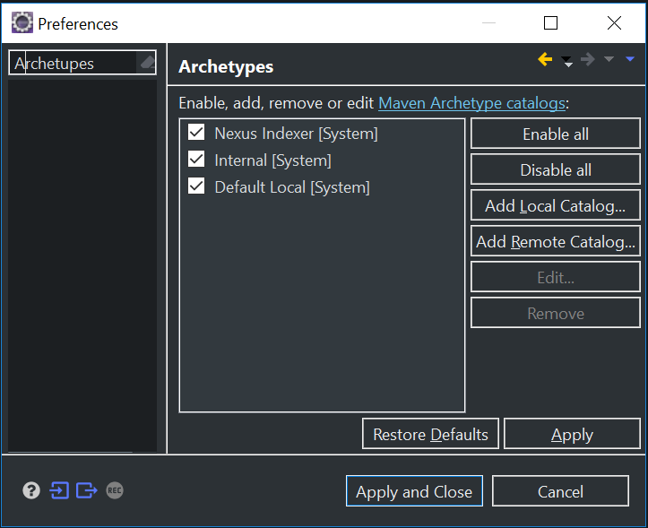

### Step 2: Aggiungere il catalog file

Cliccare su Add Remote Catalog.
Inserire nel campo catalog file http://alm-repos.sogei.it:8081/repository/maven-archetypes-releases e una descrizione.

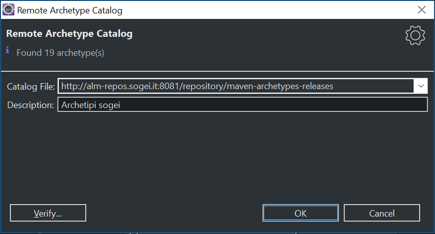

Cliccare OK per completare.

### Step 3: Verifica

Per verificare la configurazione, provare a creare un nuovo progetto maven.

File -> new -> Maven Project

TODO

## Creazione del progetto con il plugin Maven

Per la generazione di un progetto Springboot utilizzando direttamente maven digitare il seguente comando:

> mvn archetype:generate -DarchetypeGroupId=it.sogei.architecture.maven.archetypes -DarchetypeArtifactId=springboot-light-project-archetype -DarchetypeVersion=${arch-version}

Segue un esempio di generazione di progetto dall'archetipo versione 2.2.4.RELEASE:

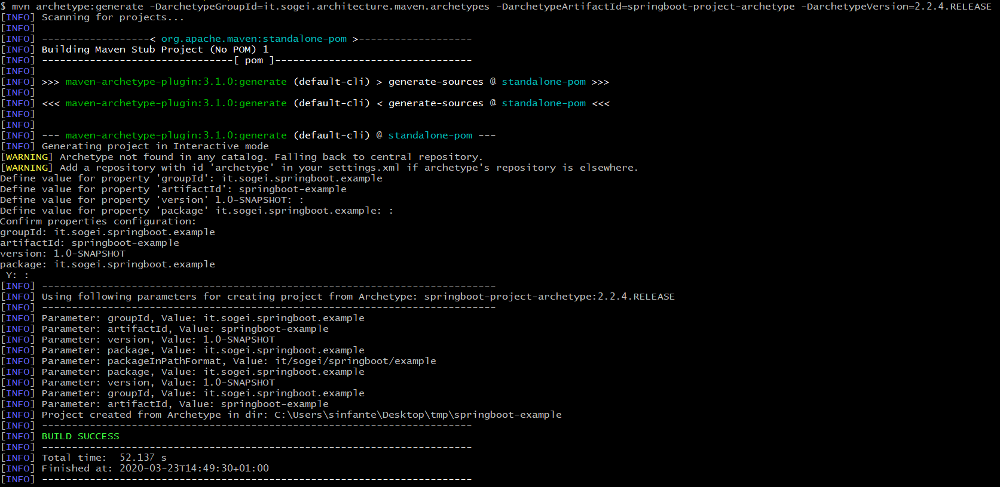

All'interno della cartella in cui viene eseguito il comando viene generato il progetto springboot-example che può essere importato come progetto Maven in Eclipse o un altro abiente di sviluppo.


## Avvio progetto in locale

### Avvio con Eclipse

Per avviare il progetto in locale una volta importato come progetto maven in Eclipse, bisogna innanzitutto installare Spring Tools for Eclipse IDE da Eclipse Marketplace.


Il file application.properites che viene preso in considerazione in locale risiede in src/resources.
Per avviare l'applicazione:

Run As -> Spring Boot App

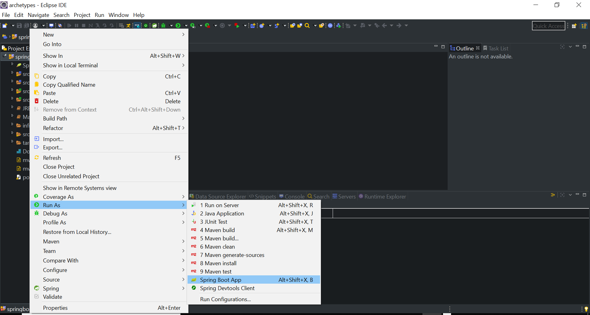

Per eseguire l'applicazione in debug:

Debug As -> Spring Boot App

## Maven plugin

Per avviare l'applicazione tramite il plugin maven, eseguire il seguene comando all'interno della root del progetto:

>mvn spring-boot:run

Per ulteriori approfondimenti:

* https://docs.spring.io/spring-boot/docs/current/maven-plugin/index.html

## Endpoint utili

Nella tabella seguente viene riportata una lista di endpoint utili, considerando che l'applicazione venga esposta sulla porta 9080 e il context-path sia example-springboot (come definito nel file applications.properties):

|                |                          |                         |
|----------------|-------------------------------|-----------------------------|
|Openapi UI|http://localhost:9080/example-springboot/openapi-ui
|Health services|http://localhost:9080/example-springboot/health
|Metrics|http://localhost:9080/example-springboot/metrics
|Prometheus|http://localhost:9080/springboot-light-project/prometheus
|Console Database|http://localhost:9080/example-springboot/h2-console

# Descrizione degli esempi forniti
L'archetipo contiene degli esempi di utilizzo delle principali feature integrate; lo sviluppatore in tal modo ha una base di partenza per implementare le sue soluzioni custom.
Di seguito l'elenco dei vari esempi, con le relative descrizioni, raggruppati per feature.

## Esposizione metriche con Actuator e Micrometer
Nella classe MagazineService del package _it.sogei.service.impl_ vi è un esempio di come possano essere implementate delle metriche custom interne. In particolare vengono forniti due esempi di metrica custom: una metrica che indica il numero di volte che il metodo _getAllMagazines_ è stato invocato ed una che dà informazioni sul tempo impiegato per la sua esecuzione.

Utilizzando la libreria Micrometer, viene inizializzata una metrica di tipo Counter con tag _type="light"_ le cui informazioni di stato saranno consultabili all'endpoint http://localhost:9080/springboot-light-project/metrics/Magazine.getAllMagazinesCount :

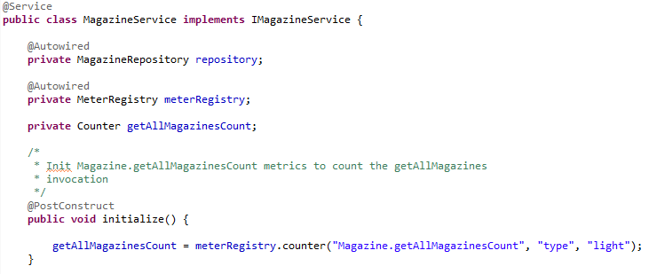

Il valore di tale metrica viene incrementato ad ogni invocazione di _getAllMagazines_ così da rimanere consistente rispetto al numero effettivo di invocazioni del metodo. L'annotation @Timed permette invece di registrare informazioni sul tempo di esecuzione del metodo stesso, definendo la seconda metrica custom di esempio:

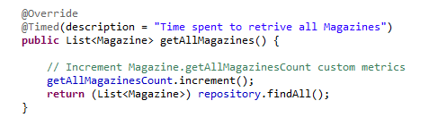

L'integrazione di Micrometer permette inoltre di attivare l'endpoint http://localhost:9080/springboot-light-project/prometheus, il quale espone i dati delle metriche (comprese quelle custom) in un formato che può essere elaborato da un server Prometheus. Se si accede a questo endpoint si possono consultare dettagliatamente tutte le informazioni relative alle metriche custom d'esempio.

## Esposizione dei servizi di Health con Actuator
Openshift Cloud Platform (OCP) utilizza due tipi di _probe_ per diagnosticare lo stato del container in esecuzione:

* _readiness probe_ : utilizzata per verificare se il container è pronto per ricevere traffico in ingresso;
* _liveness probe_ : utilizzata per verificare se il container è ancora in esecuzione o se, al contrario, deve essere riavviato.

L'ambiente OCP si aspetta che queste due _probe_ vengano esposte come endpoint http, in modo tale da poterle contattare per decidere l'azione da intraprendere. In questo ci viene in aiuto Actuator, il quale di default dispone di endpoint utili per monitorare lo stato delle risorse coinvolte nell'esecuzione.

Nell'esempio presente nell'archetipo vengono abilitati, tra gli altri, gli endpoint http _health_ (rimappato come _ready_) e _live_, esposti rispettivamente agli indirizzi http://localhost:9080/springboot-light-project/health/ready e http://localhost:9080/springboot-light-project/health/live , impostando le seguenti properties del file _application.properties_ :

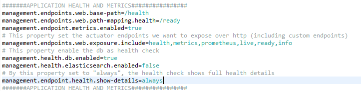

L'endpoint _health_ di Actuator mostra le informazioni sullo stato di salute dei componenti con cui interagisce l'applicazione (DB, disco, ecc.) e, configurato come nell'_application.properties_ d'esempio, è in grado di restituire anche informazioni di dettaglio.

Mentre l'endpoint _health_ è fornito direttamente da Actuator, l'endopint _live_ è un endpoint custom implementato dalla classe _LivenessCheckController_ , il quale ha solo finalità di esempio e se contattato restituisce semplicemente un'istanza _Health_ e Status code 200 OK:

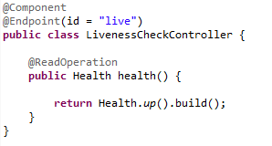

Nell'esempio dell'archetipo, sono gli endpoint _health_ e _live_ ad implementare le _probe_ _readiness probe_ e _liveness_probe_ ma lo sviluppatore che utilizza l'archetipo può chiaramente implementare le proprie _probe_ prendendo spunto dagli esempi.

## Strato di logging
Il logging è implementato con le librerie di _Logback_ ed è configurabile attraverso il file _logback.xml_ presente sotto _src/main/resources_. Dal file _application.properties_ è possibile impostare il formato del logging a JSON semplicemente cambiando il valore della property _log.output.format_ da _console_ a _json_.

## Sistema di tracing
Le informazioni di tracing sono integrate automaticamente nei log attraverso le librerie di Sleuth. Sleuth utilizza due informazioni per individuare esattamente a che punto e dove si trova l'applicazione mentre elabora una richiesta:
* _traceId_ : id assegnato ad una singola richiesta;
* _spanId_ : id che identifica il singolo step d'esecuzione della richiesta.

Utilizzando i log nei metodi HTTP dei componenti @RestController, è possibile visualizzare le informazioni di tracing (integrate nei log stessi) direttamente in console per ogni richiesta HTTP pervenuta. Ad esempio, chiamando il metodo GET http://localhost:9080/springboot-light-project/api/v1/magazines, che restituisce tutti i _magazine_ presenti, si ottiene in console la seguente stringa di log:

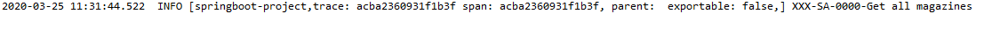

Come si nota dall'immagine, i campi _trace_ e _span_ rappresentano le informazioni di tracing.

## Meccanismo di Retry
Questo meccanismo permette la riesecuzione per un certo numero di volte del corpo di un metodo (ad esempio un metodo esposto in HTTP) a fronte di un'eccezione sollevata, dovuta per esempio al fallimento dell'invocazione di un servizio remoto al momento non disponibile. Al termine dei tentativi di esecuzione deve essere eseguito direttamente un metodo che implementa un'azione di _recover_. L'annotation @Retryable di Spring Retry permette di gestire un qualunque metodo con questo meccanismo. Nell'archetipo ne è riportato un esempio. In particolare, nel componente @RestController _GenericController_ viene simulato un meccanismo di questo genere. Nell'interfaccia _IGenericController_ è possibile notare che il metodo HTTP GET _retryMethodExample_ è annotato con @Retryable:

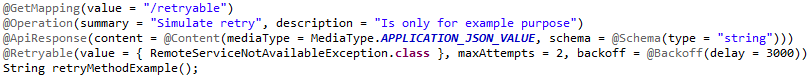

Il corpo del metodo a fronte di un'eccezione di tipo _RemoteServiceNotAvailableException_ viene eseguito 2 volte a distanza di 3 secondi, dopodiché viene eseguita direttamente l'azione di _recover_ , implementata nella classe _GenericController_:

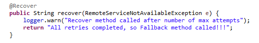

Il metodo HTTP GET di esempio è esposto all'endpoint http://localhost:9080/springboot-light-project/api/v1/generics/retryable/.

## Meccanismo di Circuit Breaker
Il meccanismo di Circuit Breaker in genere viene applicato ad una API Rest la cui esecuzione presuppone l'invocazione di un servizio esterno. A fronte di un certo numero di richieste fallite (e.g. il servizio esterno non è al momento disponibile), permette di dirottare tutte le richieste successive ad un metodo detto di fallback (apertura del circuito); solo allo scadere di un certo numero di secondi richiude il circuito e le successive richieste verranno servite nuovamente dall'API Rest. L'archetipo dispone di un esempio di simulazione del meccanismo di Circuit Breaker, implementato con le librerie di Hystrix. Nel componente @RestController _GenericController_ vi è il metodo HTTP GET _getExampleCircuitBreaker_ nel quale viene simulata l'invocazione di un servizio esterno che al momento non risponde tramite _Thread.sleep(2000)_:

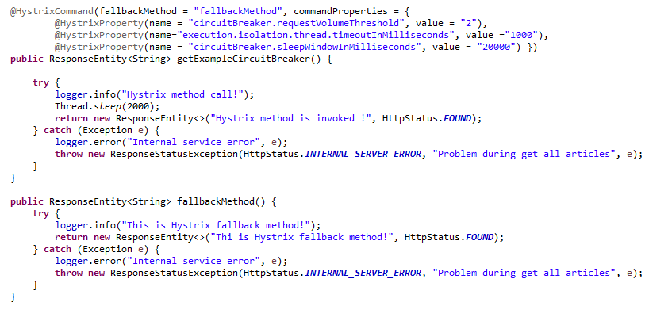

* Se il servizio non risponde entro 1 secondo (execution.isolation.thread.timeoutInMilliseconds) verrà conteggiato come una richiesta fallita;
* dopo 2 richieste fallite (circuitBreaker.requestVolumeThreshold) il circuito viene aperto e le successive richieste vengono dirottate direttamente sul method di fallback (fallbackMethod);
* il sistema verrà richiuso solo dopo il termine di 20 secondi (circuitBreaker.sleepWindowInMilliseconds) ed il metodo getExampleCircuitBreaker() verrà rieseguito nuovamente.

Per fare il test ci devono essere 3 richieste successive entro 20 secondi, e si vedrà che alla terza richiesta verrà eseguito direttamente il metodo di fallback. Dopo 20 secondi il circuito verrà richiuso e sarà rieseguito nuovamente il metodo getExampleCircuitBreaker.

Il metodo HTTP GET di esempio è esposto all'endpoint http://localhost:9080/springboot-light-project/api/v1/generics/circuitbreaker/.

# Deployment su Openshift

La cartella infrastructure contiene le configurazioni che dovranno essere utilizzate per ciascun ambiente target utilizzando il meccanismo delle config-map messo a disposizione da OpenShift.


```
infrastructure / envs
               / runtime
               / template
```

### infrastructure / envs

Per ogni ambiente su cui verrà distribuita l'applicazione dovrà essere predisposta all'interno della cartella envs una cartella con il nome dell'ambiente target, contenente i file di configurazione per i quali si vogliono creare le config-map.

L'archetipo prevede una sola config-map per l'ambiente di laboratorio (lab) legata al file di configurazione application.properties.


```
infrastructure / envs / lab /configmap / application.properties
```

Nella cartella envs è contenuto anche il file template.vars che serve per parametrizzare i file di deployment presenti nella cartella infrastructure / template.
```
TFS_TEAMPROJECT         : Team Project
SERVIZIO_ICT            : Servizio ICT
CODICE_APPLICAZIONE     : Codice applicazione
APP_READINESSPROBE_URL  : Endpoint servizio di readiness
APP_LIVENESSPROBE_URL   : Endpoint servizio di liveness
PROJECT_REQUESTING_USER : Utenza richiedente
PROJECT_ADMIN_USER      : Utenza amministratore
```

### infrastructure / runtime

In questa cartalla possono essere posizionati i file di configurazione del runtime dell'applicazione.

### infrastructure / template

Nella cartella è contenuto il template di openshift che servirà alla pipeline per effettuare tutte le operazioni necessarie al rilascio ed all’avvio del container a partire da una immagine costruita in fase di build.
In particolare, i template permettono di definire un insieme di risorse che possono essere parametrizzate e che saranno create sul progetto in OpenShift. Potrà essere necessario aggiungere nuove config map o secret, e per questo bisognerà intervenire sul file:
*  infrastructure / template / deploy-springboot-tomcat.yaml.

Seguono esempi di config-map presenti nel file di deployment.
```yaml

#Config-map per applications.properties
...

        volumeMounts:
          - mountPath: /deployments/application.properties
            name: ${REPO_GIT}-volume
            subPath: application.properties
...

 volumes:
        - name: ${REPO_GIT}-volume
          configMap:
            defaultMode: 420
            items:
            - key: application.properties
              path: application.properties
            name: ${REPO_GIT}-cm
...
```
# CICD su TFS

In questa sezione viene descritto come creare pipeline CI/CD per il deploy su Openshift di un progetto creato dall'archetipo.

## Build Definition

Per definire una nuova pipeline di Build per la Continuous Integration seguire la seguente documentazione:

* http://alm-admin.sogei.it/docalm/Continuous_Integration/Capitolo2/build-definition.html

Dovrebbero essere definite almeno le seguenti build definition:

1. feature;
2. pullrequest.
3. develop;

### 1. feature

Questa build definition deve innescarsi per ogni commit su un ramo di feature, ovvero bisogna attivare la continuous integration per rami di feature:

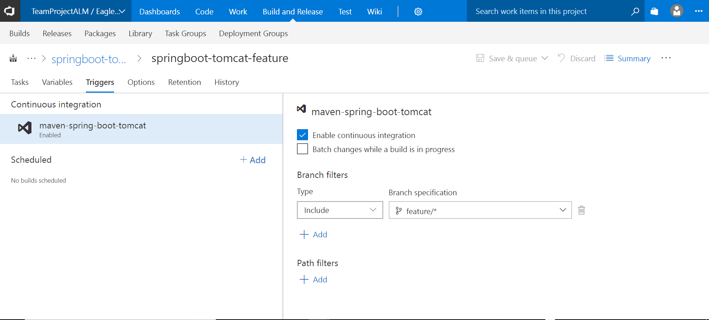

I task da inserire in questa build definition sono:

1. esecuzione test;
2. analisi statica.


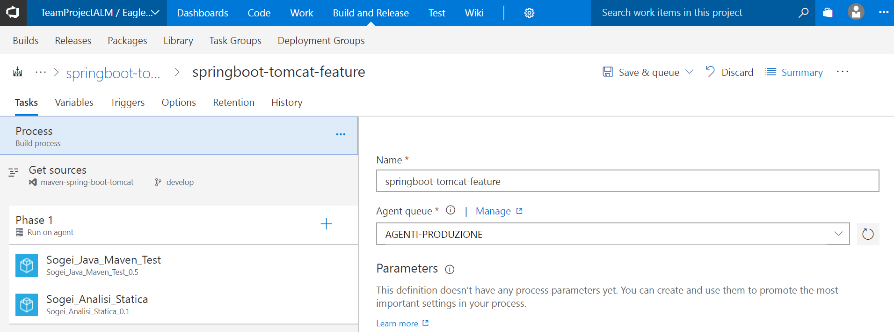

### 2. pullrequest

Per verificare la qualità del codice prima di integrarlo sui rami pregiati può essere creata una build definition ed associata ad una pullrequest, ulteriori dettagli al link seguente:

* http://alm-admin.sogei.it/docalm/Continuous_Integration/Capitolo7/creazione-pl.html?highlight=pull%20request

I task da inserire in questa build definition sono:

1. esecuzione test;
2. analisi statica;
3. analisi sicurezza;
4. build maven;

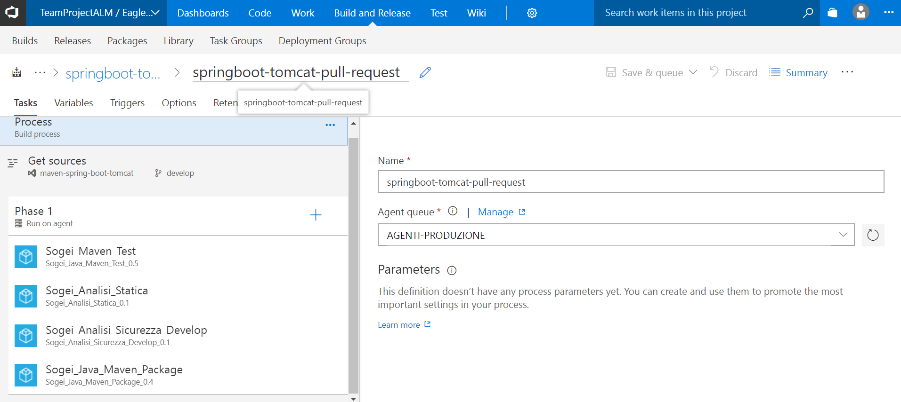

### 3. develop

Questa build definition pubblica gli artefatti ovvero la cartella infrastructure necessaria per il deploy su Openshift. Contestualmente viene generata l'immagine docker a cui i file di deployment fanno riferimento.

I task da inserire in questa build definition sono:

1. esecuzione test;
2. analisi statica;
3. analisi sicurezza;
4. build maven;
5. build docker;
6. pubblicazione artefatti.

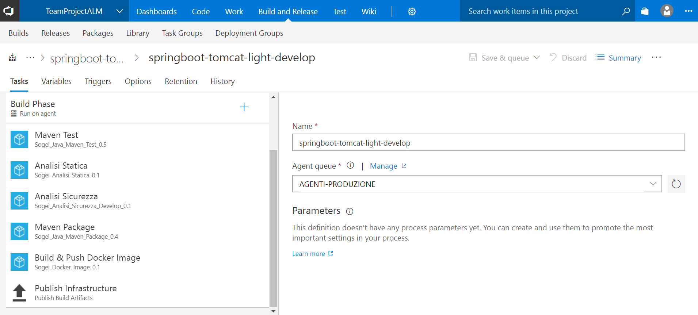

## Release Definition

Per eseguire il deployment di un artefatto generato dalla build definition develop deve essere creata una release definition.

### Release Defintion per ambiente di laboratorio

Per creare una nuova release definition andare nella seguente sezione del TFS:
 * Build and Release -> Releases -> + -> Create release definition

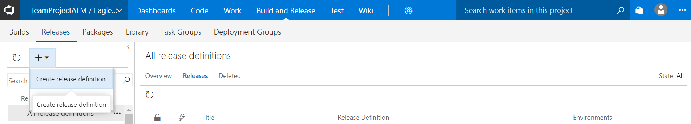

Selezionare nella sezione artifacts la build definition da cui prelevare gli artefatti e nella sezione envirements un nuovo ambiente Laboratorio:

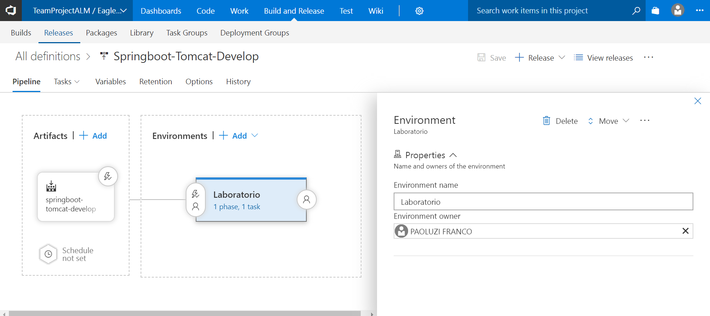

Aggiungere una fase selezionando come Agent AGENTI-PRODUZIONE e il task per il deploy su Openshift:

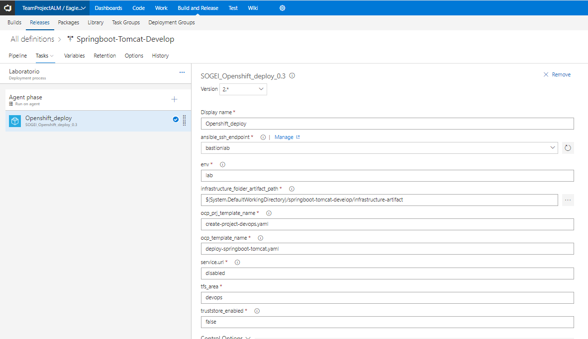

Tra le configurazioni principali di questo task ci sono:

* env: ambiente su cui verrà eseguito il deploy
* infrastructure_folder_artifact_path: cartella infrastructure pubblicata dalla build;
* ocp_prj_template_name e ocp_template_name: nomi dei file per il deployemnt contenuti all'interno della cartella infrastucture / template;
* tfs_area: area del tfs a cui l'applicazione afferisce.

# Installazione standalone

Utilizzando SpringBoot con l'installazione embedeed di un Server quali Tomcat*, Jetty, Undertow, l'applicazione può essere avviata su qualunque bare metal che abbia a disposizione una JVM della versione adeguata. Lo start dell'applicazione può essere eseguita utilizzando il comando:

_java -jar mia_applicazione.jar_

*__Attenzione:__ essendo i Server molto simili in termini di utilizzo di memoria e performance, la scelta dovrebbe ricadere quanto più possibile su Tomcat che è il progetto più maturo dei tre (casi ed esigenze specifiche andrebbero valutate ad hoc).

Nell'installazione standalone la configurazione deve essere tutta esternalizzata rispetto al jar. Per configurazione esternalizzata si intende:
* la gestione  del/i file di properties (nell'esempio useremo il default application.properties)
* file di configurazione dei log (nell'esempio l'implementazione di riferimento è logback con file di configurazione logback.xml)

Per la gestione dei file di properties basta esplicitare nello start:

_java -jar springboot-light-project.jar --spring.config.location=file:/config/application.properties_

Per la gestione dei log basta esplicitare una variabile -Dlogging.config al file esterno:

_java -jar springboot-light-project.jar -Dlogging.config=file:/config/logback.xml*_ 

*__Attenzione:__ per quanto riguarda la variabile _logging.config_ potrebbe essere spostata anche direttamente su _application.properties_ evitando quindi di dover gestire il passaggio di proprietà direttamente nel comando di start. 

## Logging 

Per quanto riguarda la scrittura dei log devono essere salvati su file system.

# Tips and tricks

In questa sezione sono elencti alcuni accorgimenti che abbiamo adottato per facilitare lo sviluppo:

* nel pom è presente il paccetto spring-boot-devtools che tra le cose principali permette un hot deploy del codice a seguito di modifche
* per provare la mutua autenticazione è stato fornito un file README-SelfSignedCertificate.txt con le istruzioni per la generazione di certificati self-signed
* nelle proprieties è inserita la proprietà _config.type_ che permette di non eseguire automaticamente alcune _@Config_ all'avvio dell'applicazione; ad esempio se voglio operare in un ambiente lab o eseguire i test,
  e voglio escludere alcune classi posso inserire _@ConditionalOnProperty(value="config.type", havingValue="production")_ e mettere _config.type=lab_ nel file di properties relativo all'ambiente
* per lo sviluppo in locale, sono disabilitati l'SSL e SpringBoot Security perchè sull'_application.propertie_ sotto la cartella _resource_ sono impostate le proprietà:
  * config.type=local
  * spring.autoconfigure.exclude=org.springframework.boot.autoconfigure.security.servlet.SecurityAutoConfiguration,org.springfra		mework.boot.actuate.autoconfigure.security.servlet.ManagementWebSecurityAutoConfiguration
* se si volessero provare la sicurezza SSL basta impostare config.type=production e eliminare la riga di exclude sul file _application.propertie_
	 
 
# Autori e ringraziamenti
Un ringraziamento speciale va a tutta la struttura IAG AAS e agli autori che hanno contribuito alla realizzazione di questo archetipo, elencati di seguito in ordine alfabetico:


|      __Autore__  		|        __Email__         	|
| --------------------	| -------------------------	|
| Alessandro Mancini 	|  amancini@sogei.it		|	
| Fabio Fatelli	   		|  ffatelli@sogei.it		|
| Franco Paoluzi	   	|  fpaoluzi@sogei.it		|
| Matteo Francese	   	|  mfrancese@sogei.it		|	
| Narcisa Madalina Rus	|  nrus@sogei.it			|
| Nello Polidoro		|  npolidoro@sogei.it		|
| Simone Infante		|  sinfante@sogei.it		|
| Stefano Agostini		|  sagostini@sogei.it		|


<!-- Markdown link & img dfn's -->
[spring-image]: https://img.shields.io/badge/springboot-2.2.4.RELEASE-blue
[spring-url]: https://spring.io/
[spring-doc-image]: https://img.shields.io/badge/springdoc--openapi--ui-1.2.26-orange
[spring-doc-url]: https://springdoc.org/
[spring-cloud-image]: https://img.shields.io/badge/spring--cloud-Greenwich.SR1-orange
[spring-cloud-url]: https://spring.io/projects/spring-cloud
[logback-image]: https://img.shields.io/badge/logback-0.1.5-orange
[logback-url]: http://logback.qos.ch/